# Frontend Mentor - E-commerce product page solution

This is a solution to the [E-commerce product page challenge on Frontend Mentor](https://www.frontendmentor.io/challenges/ecommerce-product-page-UPsZ9MJp6). Frontend Mentor challenges help you improve your coding skills by building realistic projects.

## Table of contents

- [Overview](#overview)
  - [The challenge](#the-challenge)
  - [Screenshot](#screenshot)
  - [Links](#links)
- [My process](#my-process)
  - [Built with](#built-with)
  - [What I learned](#what-i-learned)
  - [Continued development](#continued-development)
  - [Useful resources](#useful-resources)
- [Author](#author)

## Overview

### The challenge

Users should be able to:

- View the optimal layout for the site depending on their device's screen size
- See hover states for all interactive elements on the page
- Open a lightbox gallery by clicking on the large product image
- Switch the large product image by clicking on the small thumbnail images
- Add items to the cart
- View the cart and remove items from it

### Screenshot

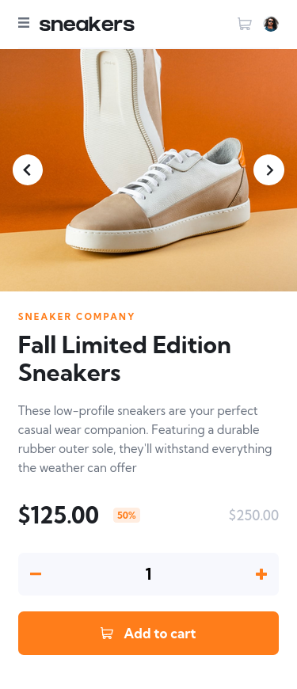
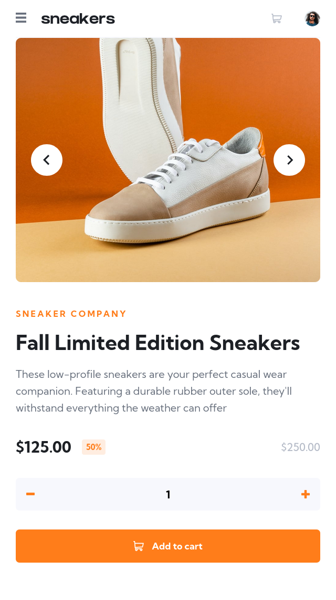
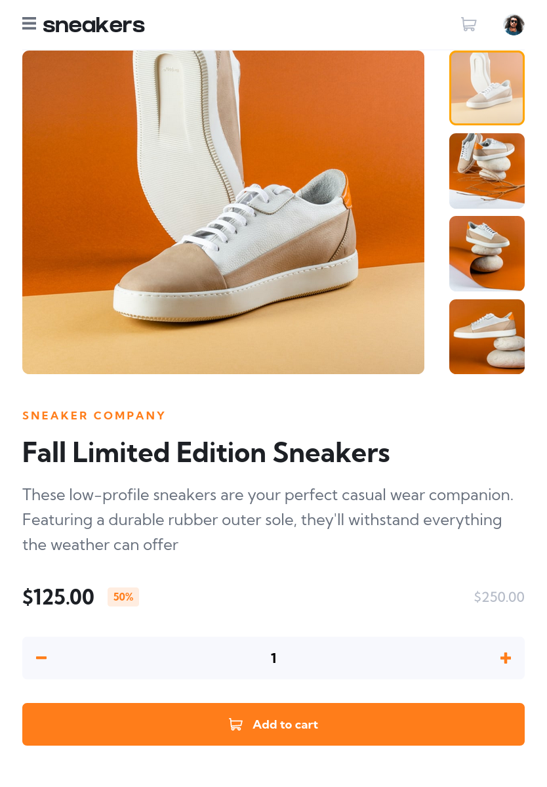
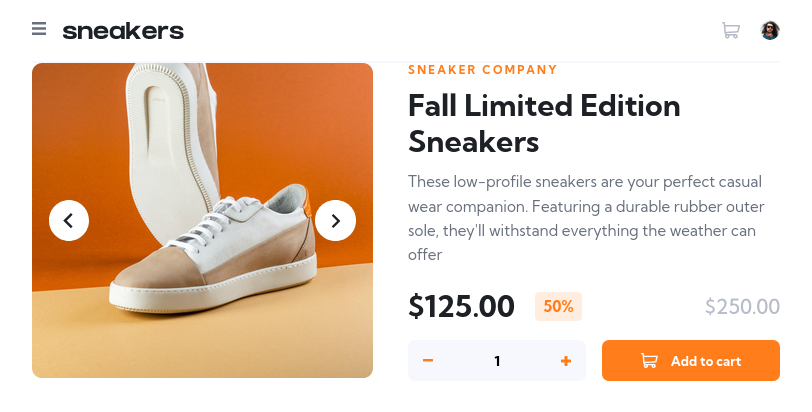
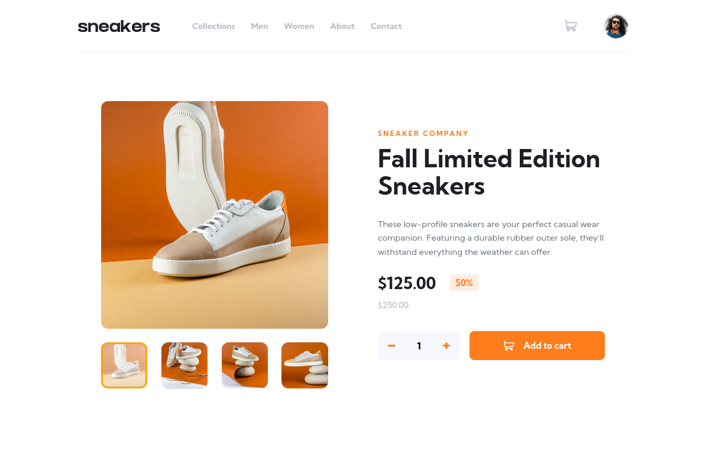
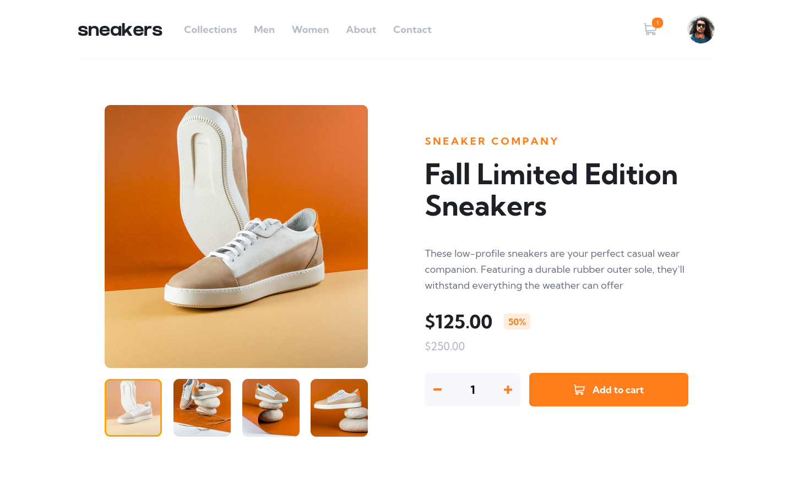
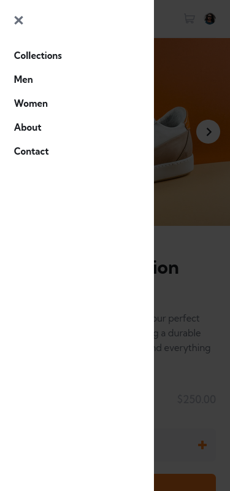
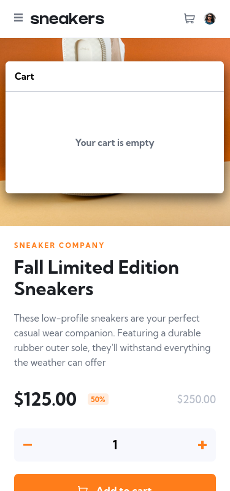
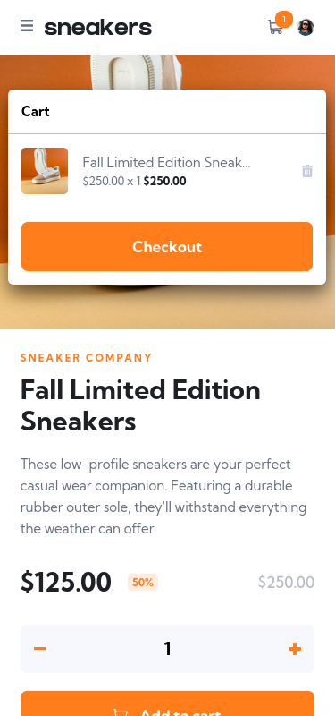
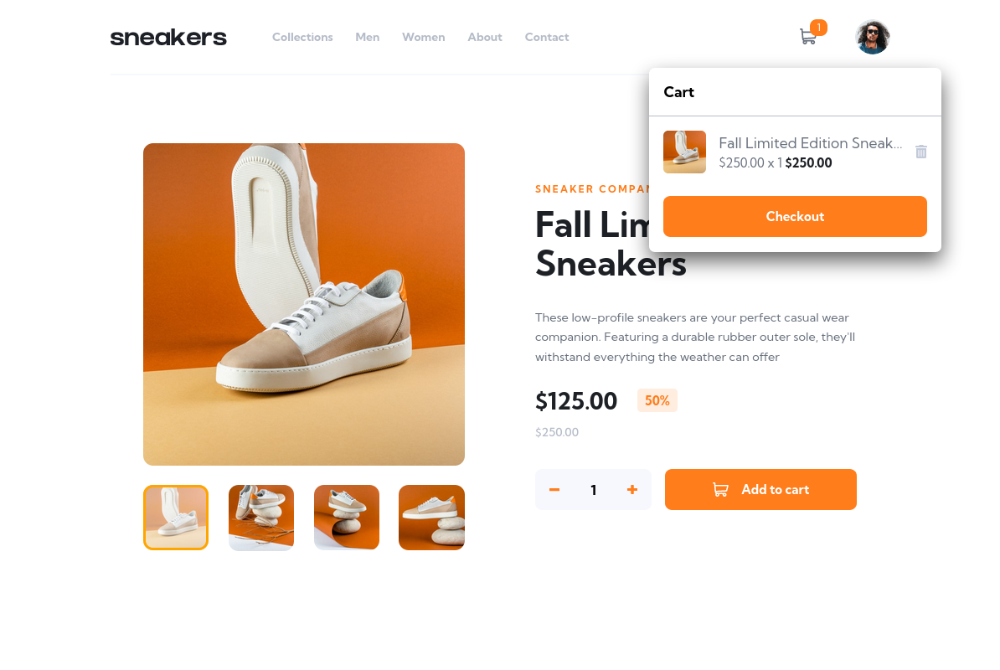
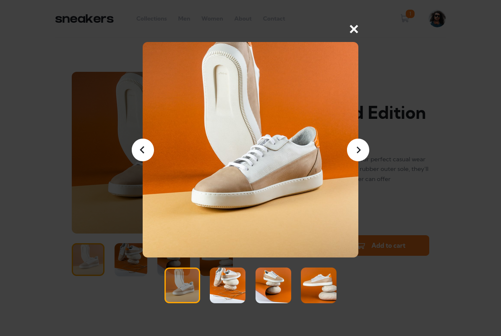

### Links

- Solution URL: [Github](https://github.com/gedesurya125/e-commerce)
- Live Site URL: [Live Site Url](https://surya-product-page.netlify.app/)

## My process

1. Building theme template and also publish it into npm called @gedesurya125/surya-ui
2. Creating the project folowing the mobile first workflow
3. Creating image slider and cart functionality
4. Fixing bug and touch up the design
5. Deploy

### Built with

- [Theme-ui](https://theme-ui.com/)
- [Framer Motion](https://www.framer.com/motion/)
- Flexbox
- CSS Grid
- Mobile-first workflow
- [React](https://reactjs.org/) - JS library

### What I learned

this is my code samples that i'am proud of:

```ts
export const getResponsiveSize = (
  breakpointsScreenSize: number,
  growRatio: ThemeConfigs['growRatio'],
  normalizedRemValue: ThemeConfigs['normalizedRemValue']
) =>
  `calc(${growRatio} / ${breakpointsScreenSize} * (100vw - ${breakpointsScreenSize}px) + ${normalizedRemValue}px)`;
```

This code located in my new Ui package called @gedesurya125/surya-ui, this code create the responsive value based on physics acceleration formula. it makes the rem value grow with screen size, and you can customize the ratio of the grow

### Continued development

currently it use React Context to save the state of the cart, in the future i will try to use other state management as if the project growing

### Useful resources

- [media query css](https://www.freecodecamp.org/news/css-media-queries-breakpoints-media-types-standard-resolutions-and-more/) - This helped me to get correct breakpoints. I really liked this pattern and will use it going forward.
- [Js Media Qyert](https://www.w3schools.com/howto/howto_js_media_queries.asp) - This pattern help me to create responsive media queries using js

## Author

- Github - [I Gede Surya Adi Pranata](https://github.com/gedesurya125)
- Frontend Mentor - [@gedesurya125](https://www.frontendmentor.io/profile/gedesurya125)
- Likedin - [I Gede Surya Adi Pranata](https://www.linkedin.com/in/i-gede-surya-adi-pranata-9a2853213/)
